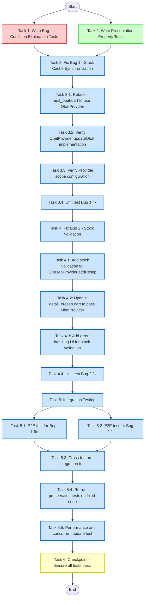

# Implementation Plan

## Overview

This implementation plan addresses two critical bugs in the pharmacy app's stock management system using the bugfix workflow methodology:

**Bug 1: Stock Cache Synchronization Failure** - When admin updates medicine stock via edit_obat.dart, the ObatProvider cache in other parts of the application (particularly petugas E-Resep screens) is not refreshed, causing stale data.

**Bug 2: Missing Stock Validation Before Prescription Save** - When petugas creates a prescription, there is no validation to check if requested quantities exceed available stock before saving.

The implementation follows a systematic approach:
1. **Phase 1: Exploration Tests** - Write property-based tests that demonstrate the bugs exist on unfixed code
2. **Phase 2: Preservation Tests** - Write tests that capture current behavior for non-buggy scenarios
3. **Phase 3: Implementation** - Apply fixes for both bugs and verify with tests
4. **Phase 4: Final Validation** - Ensure all tests pass and no regressions introduced

## Tasks

### Phase 1: Exploration Tests (BEFORE FIX)

- [x] 1. Write bug condition exploration tests for both bugs
  - **Property 1: Bug Condition** - Stock Cache Not Synced After Admin Edit & No Stock Validation Before Prescription Save
  - **CRITICAL**: These tests MUST FAIL on unfixed code - failure confirms the bugs exist
  - **DO NOT attempt to fix the tests or the code when they fail**
  - **NOTE**: These tests encode the expected behavior - they will validate the fixes when they pass after implementation
  - **GOAL**: Surface counterexamples that demonstrate both bugs exist
  - **Scoped PBT Approach**: Focus on concrete failing cases to ensure reproducibility
  
  **Bug 1 Exploration - Stock Cache Synchronization**:
  - Test that when admin updates medicine stock via edit_obat.dart and receives HTTP 200 response, the ObatProvider cache in other contexts (petugas screens) is NOT refreshed
  - Create test with two ObatProvider instances simulating admin and petugas contexts
  - Admin provider calls ObatService.updateObat() directly (mimicking current edit_obat.dart behavior)
  - Assert petugas provider's obatList still contains OLD stock value (this should PASS on unfixed code, proving bug exists)
  - Expected test outcome: Test demonstrates cache is stale - confirms Bug Condition 1 from design
  - Document counterexamples found (e.g., "Updated Cefadroxil stock to 50, petugas provider still shows 80")
  
  **Bug 2 Exploration - Missing Stock Validation**:
  - Test that when petugas creates prescription with quantity exceeding available stock, EResepProvider.addResep() succeeds without throwing exception
  - Create prescription with medicine quantity 50 when available stock is 20
  - Call EResepProvider.addResep() directly
  - Assert method completes successfully without ValidationException (this should PASS on unfixed code, proving bug exists)
  - Expected test outcome: Test shows no validation occurs - confirms Bug Condition 2 from design
  - Document counterexamples found (e.g., "Prescription with Mylanta qty 50 saved despite stock 20")
  
  **Test Implementation Details**:
  - Use mock providers and services to isolate bug conditions
  - Test files: `test/bugs/bug_condition_exploration_test.dart`
  - Use Flutter test framework with mockito for service mocking
  - Run tests on UNFIXED code to confirm bugs exist
  - **EXPECTED OUTCOME**: Tests demonstrate the bugs (cache not synced, no validation)
  - Mark task complete when tests are written, run, and bug manifestations documented
  - _Requirements: 1.1, 1.2, 1.3, 1.4, 1.5, 1.6_

### Phase 2: Preservation Tests (BEFORE FIX)

- [x] 2. Write preservation property tests (BEFORE implementing fixes)
  - **Property 2: Preservation** - Non-Stock Edits, Valid Prescriptions, Manual Refresh, Search/Filter
  - **IMPORTANT**: Follow observation-first methodology
  - **GOAL**: Ensure fixes don't break existing functionality
  
  **Observation Phase (on UNFIXED code)**:
  - Observe: Admin edits medicine name (no stock change) → Save succeeds → Cache updated
  - Observe: Petugas creates prescription with quantity ≤ stock → Save succeeds without error
  - Observe: ObatProvider.fetchObat() called manually → API fetched → Cache refreshed
  - Observe: Apply search/filter → Results filtered from cache without unnecessary API calls
  - Observe: API failure → Error message displayed appropriately
  
  **Write Property-Based Tests**:
  - **Test 1: Non-Stock Medicine Edit Preservation**
    - Property: For any medicine update that does NOT include stock changes (name, category, pricing only)
    - Verify: updateObat completes successfully, cache updated, notifyListeners called
    - From Preservation Requirements: Requirement 3.1
  
  - **Test 2: Valid Prescription Creation Preservation**
    - Property: For any prescription where ALL medicines have quantity ≤ available stock
    - Verify: addResep completes successfully without ValidationException
    - From Preservation Requirements: Requirement 3.2
  
  - **Test 3: Manual Refresh Preservation**
    - Property: For any manual call to ObatProvider.fetchObat()
    - Verify: API called, cache updated with fresh data, no side effects
    - From Preservation Requirements: Requirement 3.3
  
  - **Test 4: Search and Filter Preservation**
    - Property: For any search query and filter combination
    - Verify: Results filtered from cache, no unnecessary API calls triggered
    - From Preservation Requirements: Requirement 3.7
  
  - **Test 5: Error Handling Preservation**
    - Property: For any API failure scenario (network error, 500 response)
    - Verify: Appropriate error messages displayed, app doesn't crash
    - From Preservation Requirements: Requirement 3.6
  
  - **Test 6: Navigation Preservation**
    - Property: For any navigation between E-Resep screens
    - Verify: Form state maintained, navigation flow unchanged
    - From Preservation Requirements: Requirement 3.5
  
  **Test Implementation Details**:
  - Test file: `test/bugs/preservation_property_test.dart`
  - Use property-based testing library (faker for data generation)
  - Generate multiple test cases automatically for stronger guarantees
  - Run tests on UNFIXED code first
  - **EXPECTED OUTCOME**: All preservation tests PASS on unfixed code (confirms baseline behavior)
  - Mark task complete when tests are written, run, and passing on unfixed code
  - _Requirements: 3.1, 3.2, 3.3, 3.4, 3.5, 3.6, 3.7_

### Phase 3: Implementation

- [ ] 3. Fix Bug 1: Stock Cache Synchronization

  - [x] 3.1 Refactor edit_obat.dart to use ObatProvider
    - Remove direct `ObatService` instantiation (line 38-39)
    - Remove `final _obatService = ObatService();` field declaration
    - In `_simpan()` method (around line 164-167), replace direct service call with provider method
    - Change from: `final result = await _obatService.updateObat(widget.obat.idObat, _updatedObat!);`
    - Change to: `await context.read<ObatProvider>().updateObat(_updatedObat!);`
    - Keep Navigator.pop() with updated ObatModel for confirmation
    - _Bug_Condition: isBugCondition1 from design - admin updates stock via edit_obat.dart, API returns 200, but ObatProvider cache in other contexts not refreshed_
    - _Expected_Behavior: After successful stock update, ObatProvider SHALL update cache and notify all listeners (Property P1 from design)_
    - _Preservation: Non-stock medicine edits (name, category) SHALL continue to work unchanged (Requirement 3.1)_
    - _Requirements: 2.1, 2.2, 2.3_

  - [x] 3.2 Verify ObatProvider.updateObat() implementation
    - Review provider_obat.dart lines 140-160
    - Confirm updateObat() method updates local cache (_obatList)
    - Confirm notifyListeners() is called after successful update
    - Confirm _filterObat() is called to update filtered list
    - No code changes needed if current implementation is correct
    - _Bug_Condition: Ensure cache update and listener notification mechanism works correctly_
    - _Expected_Behavior: All ObatProvider instances throughout app reflect updated stock values_
    - _Preservation: Manual fetchObat() calls SHALL continue to work (Requirement 3.3)_
    - _Requirements: 2.1, 2.2, 2.3_

  - [x] 3.3 Verify Provider scope configuration
    - Check main.dart or app.dart for MultiProvider setup
    - Ensure ObatProvider is provided at app root level (single instance)
    - Verify all screens access the same ObatProvider instance
    - If provider scope is incorrect, refactor to use single shared instance
    - _Bug_Condition: Provider instance isolation causes cache inconsistency_
    - _Expected_Behavior: Single ObatProvider instance shared across entire app_
    - _Preservation: Existing provider access patterns SHALL remain unchanged_
    - _Requirements: 2.1, 2.2_

  - [-] 3.4 Unit test Bug 1 fix
    - **Property 1: Expected Behavior** - Stock Cache Synced After Admin Edit
    - **IMPORTANT**: Re-run exploration test from task 1 - do NOT write a new test
    - Run Bug 1 exploration test from Phase 1
    - Verify test now demonstrates cache IS refreshed when using provider method
    - Create additional unit test: Mock edit_obat.dart using provider method
    - Assert ObatProvider.updateObat() called (not direct service)
    - Assert notifyListeners() triggered
    - Assert other provider consumers receive update
    - **EXPECTED OUTCOME**: Bug 1 exploration test now PASSES (confirms bug is fixed)
    - _Requirements: 2.1, 2.2, 2.3_

- [ ] 4. Fix Bug 2: Stock Validation Before Prescription Save

  - [-] 4.1 Add stock validation to EResepProvider.addResep()
    - Modify provider_eresep.dart addResep() method (lines 138-157)
    - Add ObatProvider parameter: `Future<void> addResep(Resep resep, ObatProvider obatProvider)`
    - Before calling ResepService.createResep(), iterate through resep.detailResep
    - For each detail, find corresponding ObatModel in obatProvider.obatList
    - Compare detail.jumlah with obat.stok
    - If detail.jumlah > obat.stok, collect error message: `'${obat.namaObat}: diminta ${detail.jumlah}, tersedia ${obat.stok}'`
    - If stockErrors list is not empty, throw Exception with message: `'Stok tidak mencukupi:\n${stockErrors.join('\n')}'`
    - Only proceed to createResep() if validation passes
    - _Bug_Condition: isBugCondition2 from design - prescription with quantity > stock saved without validation_
    - _Expected_Behavior: addResep SHALL throw ValidationException when any medicine quantity exceeds stock (Property P2 from design)_
    - _Preservation: Valid prescriptions (quantity ≤ stock) SHALL save successfully (Requirement 3.2)_
    - _Requirements: 2.4, 2.5, 2.6_

  - [-] 4.2 Update detail_eresep.dart to pass ObatProvider
    - Find the method that calls eresepProvider.addResep() (likely in save button handler)
    - Access both providers: `final eresepProvider = context.read<EResepProvider>();` and `final obatProvider = context.read<ObatProvider>();`
    - Update call from: `await eresepProvider.addResep(newResep);`
    - Update to: `await eresepProvider.addResep(newResep, obatProvider);`
    - Wrap in try-catch to handle validation exceptions
    - _Bug_Condition: No validation performed before prescription save_
    - _Expected_Behavior: Validation exception caught and displayed to user_
    - _Preservation: Successful prescription creation flow SHALL remain unchanged_
    - _Requirements: 2.4, 2.6_

  - [ ] 4.3 Add error handling UI for stock validation
    - In detail_eresep.dart catch block, check if exception message contains "Stok tidak mencukupi"
    - If stock validation error, display detailed error dialog with:
      - Title: "Stok Tidak Mencukupi"
      - Message: Exception details (medicine names, requested vs available)
      - Action button: "OK" to dismiss
    - Use AlertDialog or SnackBar for error display
    - Ensure user can correct quantities and retry save
    - _Bug_Condition: User not informed when prescription exceeds stock_
    - _Expected_Behavior: Clear error message with specific medicine stock details (Requirement 2.6)_
    - _Preservation: Other error types SHALL display existing error handling_
    - _Requirements: 2.6_

  - [~] 4.4 Unit test Bug 2 fix
    - **Property 1: Expected Behavior** - Stock Validation Enforced Before Prescription Save
    - **IMPORTANT**: Re-run exploration test from task 1 - do NOT write a new test
    - Run Bug 2 exploration test from Phase 1
    - Verify test now shows ValidationException is thrown for insufficient stock
    - Create additional unit test: Call addResep() with prescription exceeding stock
    - Assert ValidationException thrown
    - Assert exception message contains "Stok tidak mencukupi"
    - Assert exception details list affected medicines
    - Create test: Call addResep() with valid prescription (quantity ≤ stock)
    - Assert no exception thrown, prescription saved successfully
    - **EXPECTED OUTCOME**: Bug 2 exploration test now PASSES (confirms validation works)
    - _Requirements: 2.4, 2.5, 2.6_

- [ ] 5. Integration Testing

  - [~] 5.1 End-to-end test for Bug 1 fix
    - **Property 1: Expected Behavior** - Stock Updates Propagate to All Screens
    - Launch app with test data
    - Navigate to admin edit_obat.dart screen for medicine "Cefadroxil"
    - Update stock from 80 to 50 and save
    - Navigate to petugas detail_eresep.dart screen
    - Verify medicine list shows updated stock value 50 (not cached 80)
    - Verify UI re-renders with fresh data
    - _Requirements: 2.1, 2.2, 2.3_

  - [~] 5.2 End-to-end test for Bug 2 fix
    - **Property 1: Expected Behavior** - Stock Validation Prevents Invalid Prescription Save
    - Launch app and navigate to petugas detail_eresep.dart
    - Create prescription with "Mylanta" quantity 30
    - Set available stock to 20 in test data
    - Attempt to save prescription
    - Verify error dialog displayed: "Stok tidak mencukupi: Mylanta - diminta 30, tersedia 20"
    - Verify prescription NOT saved to database
    - Reduce quantity to 15 and retry save
    - Verify save succeeds
    - _Requirements: 2.4, 2.5, 2.6_

  - [~] 5.3 Cross-feature integration test
    - **Property 2: Preservation** - All Core Flows Work Together
    - Admin updates multiple medicine stocks (3-5 medicines)
    - Petugas creates prescription using updated stock values
    - Verify prescription validation uses fresh stock data
    - Verify successful save for valid quantities
    - Verify blocked save for insufficient stock
    - Test navigation flow remains unchanged
    - _Requirements: 2.1, 2.2, 2.3, 2.4, 2.5, 2.6, 3.2, 3.5_

  - [~] 5.4 Re-run preservation tests on fixed code
    - **Property 2: Preservation** - Verify No Regressions
    - **IMPORTANT**: Re-run the SAME preservation tests from Phase 2 - do NOT write new tests
    - Run all preservation property tests from task 2
    - Verify all tests still PASS (non-stock edits, valid prescriptions, manual refresh, search/filter, error handling, navigation)
    - **EXPECTED OUTCOME**: All preservation tests PASS (confirms no regressions introduced)
    - If any preservation test fails, investigate and fix regression before proceeding
    - _Requirements: 3.1, 3.2, 3.3, 3.4, 3.5, 3.6, 3.7_

  - [~] 5.5 Performance and concurrent update test
    - Create test dataset with 50+ medicines
    - Admin updates multiple stocks in rapid succession (5-10 updates)
    - Verify all ObatProvider instances synchronized within 500ms
    - Verify no memory leaks from notifyListeners() calls
    - Verify UI remains responsive during updates
    - Test concurrent scenario: Admin updating stock while petugas has prescription form open
    - Verify petugas validation uses latest stock values
    - Verify no race conditions or stale data issues
    - _Requirements: 2.1, 2.2_

### Phase 4: Final Validation

- [~] 6. Checkpoint - Ensure all tests pass
  - Run full test suite: `flutter test`
  - Verify all exploration tests now demonstrate expected behavior
  - Verify all preservation tests still pass (no regressions)
  - Verify all unit tests pass
  - Verify all integration tests pass
  - Review test coverage report
  - If any test fails, investigate and fix before marking complete
  - Ask user if questions arise or additional testing scenarios needed
  - _Requirements: All (2.1-2.6, 3.1-3.7)_

## Task Dependency Graph



```json
{
  "waves": [
    {
      "name": "Phase 1: Exploration Tests",
      "tasks": ["1"]
    },
    {
      "name": "Phase 2: Preservation Tests",
      "tasks": ["2"]
    },
    {
      "name": "Phase 3: Implementation - Bug 1",
      "tasks": ["3", "3.1", "3.2", "3.3", "3.4"]
    },
    {
      "name": "Phase 3: Implementation - Bug 2",
      "tasks": ["4", "4.1", "4.2", "4.3", "4.4"]
    },
    {
      "name": "Phase 3: Integration Testing",
      "tasks": ["5", "5.1", "5.2", "5.3", "5.4", "5.5"]
    },
    {
      "name": "Phase 4: Final Validation",
      "tasks": ["6"]
    }
  ]
}
```

## Notes

### Key Testing Principles

1. **Exploration-First Approach**: Tasks 1-2 MUST be completed before implementing any fixes. These tests confirm the bugs exist and establish baseline behavior.

2. **Expected Test Failures**: The exploration tests in Task 1 are EXPECTED to fail on unfixed code. This is correct and proves the bugs exist. Do NOT attempt to "fix" these failures until Phase 3.

3. **Preservation Tests Must Pass**: The preservation tests in Task 2 MUST pass on unfixed code. If they don't, the tests are incorrect and need revision.

4. **Property-Based Testing**: Use property-based testing libraries (faker for data generation) to generate multiple test cases automatically for stronger guarantees.

### Implementation Guidelines

1. **Provider Scope**: Ensure ObatProvider is instantiated at app root level and shared across all screens. Check main.dart or app.dart for MultiProvider configuration.

2. **Cache Synchronization**: The fix for Bug 1 relies on using ObatProvider.updateObat() instead of direct ObatService calls, ensuring notifyListeners() is triggered.

3. **Stock Validation**: The fix for Bug 2 adds validation in EResepProvider.addResep() method before API calls, checking each medicine's quantity against available stock.

4. **Error Messaging**: Stock validation errors should provide clear, specific details about which medicines have insufficient stock and their available quantities.

### Testing Environment Setup

1. **Test Files**:
   - `test/bugs/bug_condition_exploration_test.dart` - Exploration tests
   - `test/bugs/preservation_property_test.dart` - Preservation tests

2. **Dependencies**:
   - Flutter test framework
   - Mockito for service mocking
   - Faker for property-based test data generation

3. **Test Data**:
   - Create mock medicine data with various stock levels (0, low, medium, high)
   - Create mock prescription data with various quantities
   - Use consistent test data across all test files

### Risk Mitigation

1. **Concurrent Updates**: Test scenarios where admin updates stock while petugas has prescription form open to ensure no race conditions.

2. **Performance**: Monitor notifyListeners() performance with large datasets (50+ medicines) to ensure UI remains responsive.

3. **API Failures**: Ensure error handling remains robust for network failures, timeouts, and server errors.

4. **Provider Lifecycle**: Verify ObatProvider is not disposed prematurely when navigating between screens.

### Success Criteria

- All exploration tests demonstrate bugs on unfixed code
- All preservation tests pass on unfixed code
- All exploration tests pass on fixed code
- All preservation tests still pass on fixed code (no regressions)
- Integration tests confirm end-to-end functionality
- Performance tests show acceptable response times (<500ms for cache updates)

